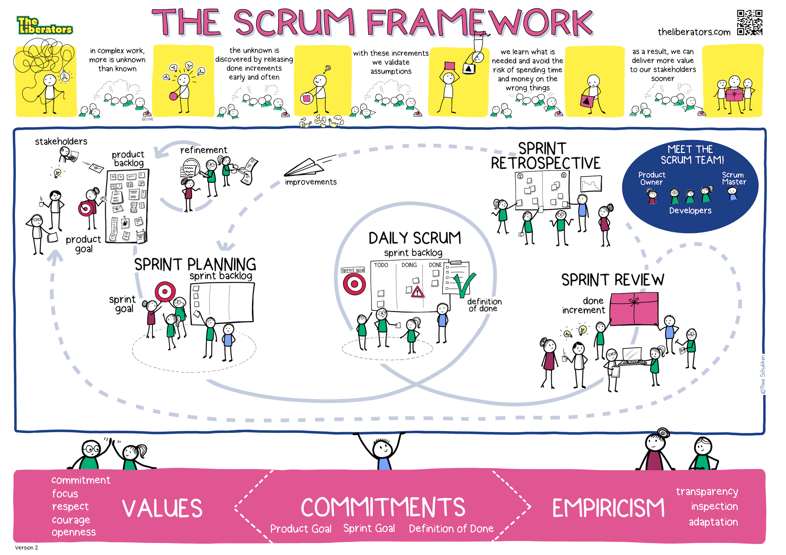
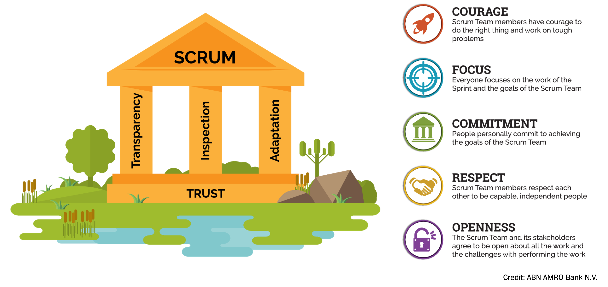

## 帶大家讀 Scrum Guide
Yuting Chou

---

## 請大家先思考一下

- Scrum到底是什麼? 
- 對我們的專案有什麼幫助?

---

## Scrum Framework

<small>[The Scrum Framework, Illustrated](https://www.scrum.org/resources/blog/scrum-framework-illustrated)</small>

---

## [Scrum Glossary](https://www.scrum.org/resources/scrum-glossary)

--

### Scrum Artifacts

Product Backlog
~ 由一個有順序的工作清單組成，裡面需要被完成的工作都是為了建立、維護和永續一個產品。由產品負責人管理。

Sprint Backlog
~ 提供理解 Sprint 目標的開發工作概覽，通常是對功能預測和交付該功能所需的工作。由開發人員管理。
    
Increment
~ 定義了開發人員在 Sprint 期間完成的且有價值的工作。所有增量的總和形成一個產品。

--

### Scrum Team

Scrum Master
~ 在 Scrum 團隊中的角色，負責指導、輔導、教導和協助 Scrum 團隊及其環境對 Scrum 的正確理解和使用。

Product Owner
~ 在 Scrum 中的角色，負責將==產品的價值最大化==，主要是通過逐步管理並向開發人員表達對產品的業務和功能期望。

Developers
~ Scrum 團隊的任何成員，無論技術、功能或其他專業，都致力於在每個 Sprint 中打造任何可用的增量（increment）。

--

### Scrum Events

Sprint
~ 時間限制為一個月或更短的 Scrum 事件，作為其他 Scrum 事件和活動的容器。Sprint 是連續進行的，中間沒有間隔。

Sprint Planning
~ 時間限制為 8 小時或更短時間以啟動 Sprint 的 Scrum 事件。它用於 Scrum 團隊檢查 Product Backlog 中最有價值的工作，並將其設計到 Sprint Backlog 中。

--

### Scrum Events (續)

Daily Scrum
~ 是每天為開發人員舉辦的 15 分鐘限時活動。 Daily Scrum 在 Sprint 的每一天舉行。在這個活動中，開發人員計劃在接下來的 24 小時內的工作。這通過檢查自上次 Daily Scrum 以來的工作並預測即將到來的 Sprint 工作來最佳化團隊協作和績效。每日 Scrum 每天在同一時間和地點舉行，以降低複雜性。

--

### Scrum Events (續)

Sprint Review
~ 設定為 4 小時或更短的 Scrum 事件，以結束 Sprint 的開發工作。它的作用是讓 Scrum 團隊和利益相關者檢查 Sprint 所產生的產品增量，評估所執行的工作對實現產品目標的總體進度的影響，並更新 Product Backlog，以最大化下一階段的價值。

Sprint Retrospective
~ 設定為 3 小時或更短的 Scrum 事件，以結束 Sprint。它的作用是讓 Scrum 團隊檢視過去的 Sprint 並計劃在未來的 Sprint 中實施的改進。

---

## Scrum的定義

> Scrum 是一個輕量化的框架，透過提供針對錯綜複雜（complex）問題的調適性解決方案，來幫助人們、團隊與組織產生**價值**。

---

## Scrum的理論

Scrum 建立在==經驗主義（empiricism）== 和 ==精實思維（lean thinking）== 之上。 

- 經驗主義（empiricism）堅信，知識來自經驗，以及根據觀察到的事物做出決策。
- 精實思維（lean thinking）減少浪費，專注於根本。

--

## Scrum的理論 (續)

- Scrum 採行==迭代（iterative）== 和 ==增量（incremental）== 方法來優化對未來的預測性並控制風險。

- Scrum 讓一群共同擁有所有技能和專長的人員參與來完成工作，並根據需要來分享或獲取所需技能。

--

## Scrum的理論 (續)

- Scrum 有四個正式檢視與調適的事件，並且用另外一個事件：Sprint 來包含這四個事件。

- 這些事件起作用的原因是它們實現了以經驗為導向的 Scrum 支柱：==透明性、檢視性與調適性==。

---

## Scrum的三大支柱

- 透明性（Transparency）
- 檢視性（Inspection）
- 調適性（Adaptation）

--

### 透明性（Transparency）
> 湧現的（Emergent）流程和工作必須對執行工作和接受工作的人員都是可見的。

- 在 Scrum 裡，重要的決策是基於對其三個正式 artifacts 的感知狀態。
    - 透明性低的 artifacts 會導致做出讓價值減少且風險增加的決策。

- 透明性促成檢視性（Inspection）。 
    - 没有透明性的檢視會產生誤導和浪費。

--

### 檢視性（Inspection）
> 必須要經常用心地檢視 Scrum 的 artifacts 與一致同意的目標進度，以便發現潛在的誤差和問題。

- 為了有助於檢視性，Scrum 以五個事件的形式提供了穩定的節奏。
- 檢視性促成調適性（Adaptation）。 沒有調適性的檢視是沒有意義的。 Scrum 的事件旨在激發改變。

--

### 調適性（Adaptation）
> 若是流程的任何方面已偏離且超出可接受的範圍，或是所得的產品無法被接受，則必須將所採用的流程或其打造出來的材料進行調整。

- 調整工作必須盡快執行，以減少未來更多的偏差。
- 當相關人員未獲得授權，或無法自我管理（self-managing）時，調適性將變得更加艱難。
- 一個 Scrum Team 透過檢視而學習到的新事物之當下，應當立刻調適。

---

## Scrum 的價值觀

> 承諾、專注、開放、尊重、與勇氣
> (Commitment, Focus, Openness, Respect, and Courage)

--

### 承諾 (Commitment)

Scrum Team 致力於達成其目標並彼此相互支援。

--

### 專注 (Focus)

Scrum Team 主要專注在 Sprint 的工作，盡可能地朝向目
標前進，以獲取最好的進展。

--

### 開放 (Openness)
Scrum Team 與其利害關係人（stakeholders）對於工作及挑戰抱持著
開放的態度。

--

### 尊重 (Respect)
Scrum Team 的成員們互相尊重對方是個有能力和獨立的人，同時也受其他同事同等的尊重。

--

### 勇氣 (Courage)
Scrum Team 的成員們有勇氣去做對的事情、並處理棘手的問題。

---

## Scrum 的價值觀 (續)

- 這些價值觀指引了 Scrum Team 的工作、行動與行為。
- 所做出的決定、所採取的步驟與如何使用 Scrum 都應該反覆的加強這些價值觀，而不是削弱或破壞這些價值觀。
- Scrum Team 成員們依照 Scrum 的事件和 artifacts 來學習並探索這些價值觀。
- 當 Scrum Team 以及與工作的同事們展現了這
些價值觀，就能活現出 Scrum 經驗的支柱：==透明性、檢視性與調適性==，並在每個人之間建立==信任==。

---

## The House of Scrum

<small>[What is Scrum?](https://www.scrum.org/resources/what-is-scrum)</small>

---

## Scrum Team
- Scrum 以小團隊作為基本單位，稱為 Scrum Team。
- Scrum Team 由一名 Scrum Master、一名Product Owner 與 Developers 所組成。
- 在 Scrum Team 內沒有子團隊或是階級架構，是由一群具有
凝聚力的專業人士，一次只專注在一個目標上：**Product Goal**。

--

## Scrum Team (續)
- Scrum Teams 是跨職能（cross-functional）的
    - 成員們擁有在 Sprint 內創造價值所需的所有技能。
    - 他們也是自我管理（self-managing）的
        - 他們在團隊內部決定誰做什麼、何時做以及如何做。

--

## Scrum Team (續)

- Scrum Team 規模足夠小以保持靈活性，同時足夠大以便可以在 Sprint 內完成重要的工作，通常人數在 10 人以下。
    - 一般而言，我們發現越小的團隊溝通越好，生產力更高。
- 如果 Scrum Teams 變得太大
    - 應該考慮重新組織為多個有凝聚力的 Scrum Team
        - 每個團隊還是專注在同一個產品
        - 有著相同的 Product Goal、Product Backlog 和 Product Owner。

--

## Scrum Team (續)

- Scrum Team 負責所有與產品相關的活動，像是與利害關係人（stakeholder）的協同合作、驗證、維護、營運、實驗、研究、和開發以及任何其他可能需要的工作。
- 組織成立 Scrum Team 並授權他們自行管理工作。
- 在 Sprint 中維持可持續的步調工作，可以加強 Scrum Team 的專注與一致性。

--

## Scrum Team (續)

- 整個 Scrum Team 都有責任在每個 Sprint 中創造出有價值的、有用的 Increment。
- Scrum 在Scrum Team 中定義了三種特定的當責（accountabilities） 
    - **Developers**、**Product Owner** 和 **Scrum Master**。

---

## Developers
> Scrum Team 當中的 Developers 是指在每個 Sprint 致力於打造任何可用 Increment 的成員。

--

## Developers (續)

- Developers 所須具備的特定技能通常很廣泛，並且會隨著工作領域不同而有别。
- Developers 總是對以下事項負有責任：
    - 打造一份 Sprint 的計畫，也就是 Sprint Backlog；
    - 藉由遵循完成之定義，以灌輸品質；
    - 每天調適其邁向 Sprint Goal 的計畫；
    - 作為專業人士對彼此負責。

---

## Product Owner
> Product Owner 負責將把 Scrum Team 的工作所打造出來的產品價值最大化。如何做到這一點可能會依組織、Scrum Teams 和個人的不同而有極大的差異。

--

## Product Owner (續)

- Product Owner 也負責對 Product Backlog 進行有效的管理，包括：
    - 開發並明確的描述溝通 Product Goal；
    - 創造並清楚的描述溝通 Product Backlog items；
    - 對 Product Backlog items 進行排序；
    - 確保 Product Backlog 是透明的、可見的與可理解的。
- Product Owner 可以自己做上述工作，或者也可以將職責委託他人，然而，Product Owner 仍肩負最終責任。

--

## Product Owner (續)

- 為了讓 Product Owners 成功，整個組織必須尊重他們的決定，這些決定在 Product Backlog 内容和順序中可以被看見，並且在 Sprint Review 時透過可檢視的 Increment 展現出來。
- Product Owner 是一個人，而不是一個委員會。
- 在 Product Backlog 中， Product Owner 可能代表了許多利害關係人（stakeholders）的需求，==想要改變 Product Backlog 的人可以試著去說服 Product Owner==。

---

## Scrum Master
> Scrum Master 負責按照 Scrum 指南來建立 Scrum，方式是透過幫助 Scrum Team 內與組織內部的每個人了解 Scrum 的理論與實作。

--

## Scrum Master (續)

- Scrum Master 對 Scrum Team 的效能負責。 
    - 透過讓 Scrum Team 在 Scrum 框架內改善其實務作法來做到這一點。
- Scrum Masters 是真正的領導者，服務對象是 Scrum Team 和更大範圍的組織。

--

### Scrum Master 服務於 Scrum Team

- 以教練方式提升團隊成員的自我管理（self-management）與跨職能能力（crossfunctionality）；
- 協助 Scrum Team 專注於打造出滿足完成之定義且具備高價值的 Increments；
- 促使 Scrum Team 的阻礙被移除掉；
- 確保所有的 Scrum 事件都舉行，有建設性、有成效的並且保持在時間盒（timebox）內進行。

--

### Scrum Master 服務於 Product Owner

- 幫助找到有效定義 Product Goal 與管理 Product backlog 的技巧；
- 幫助 Scrum Team 理解為何需要清楚且簡明的 Product Backlog items；
- 幫助在錯綜複雜（complex）的環境下，建立以經驗為導向的產品計畫；
- 當被要求或需要時，引導利害關係人（stakeholder）的協同運作。

--

### Scrum Master 服務於組織

- 在組織採用 Scrum 的過程中，以領導、訓練和教練方式帶領組織；
- 在組織內，規劃並指導 Scrum 的執行運作；
- 幫助員工和利害關係人（stakeholders）理解與制定以經驗為導向的方法來處理錯綜複雜（complex）的工作；
- 移除利害關係人（stakeholders）與 Scrum Teams 之間的障礙。

---

## Scrum 事件
- Sprint 是所有其他事件的容器。
- Scrum 中的每個事件都是用來==檢視與調適 Scrum artifacts 的正式機會==。
- 這些事件都是為實現所需要的透明性而特別設計的。
- 未能按規定運作任何事件將導致失去檢視和調適的機會。
- Scrum 使用事件來創造==規律性==，並以此==減少 Scrum 中未定義的會議的需要==。
    - 最理想的是，所有事件都在同一時間同一地點舉行，以減少複雜性。

---

## Sprint
> Sprint 是 Scrum 的核心，在這裡能將創意轉化為價值。
> Sprint 是固定時間長度的事件，為期一個月或更短，以保持一致性。前一個 Sprint 結束，下個新Sprint 就緊接著開始。

--

## Sprint (續)

- 所有為了達成 Product Goal 的工作都發生在各個 Sprints 內，包括 **Sprint Planning**、**Daily Scrums**、**Sprint Review**、和 **Sprint Retrospective**。
- 在 Sprint 期間：
    - 不得做出危及 Sprint Goal 的改變；
    - 不得降低品質；
    - 需要時將 Product Backlog 精煉; 和；
    - 隨著學到更多，可以與 Product Owner 針對範疇作進一步澄清與重新協商。

--

## Sprint (續)

- 藉由至少每個月一次對邁向 Product Goal 的進度來進行檢視與調適，Sprint 促成了可預測性。
    - 當Sprint 的時間太長，可能導致 Sprint Goal 失效，複雜性的程度可能會上升，以及風險可能會增高。
    - 採用時間較短的 Sprint，可以建立更多學習周期，並將成本與氣力的風險控制在一個較短的時間内。
- 每一個 Sprint 都可以視為一個短期專案。

--

## Sprint (續)

- 用來預測進度的實務做法有很多種，像是燃盡圖、燃起圖，或是累積流量圖。 
    - 雖然這些做法是有用處的，但不能取代經驗主義（empiricism）的重要性。
    - 在錯綜複雜（complex）的環境中，接下來會發生什麼是不可知的。只有已經發生的事物才能用來做前瞻性的決策基礎。
- 若 Sprint Goal 已經不合時宜，可以取消 Sprint。==只有 Product Owner 有取消 Sprint 的權限==。

---

## Sprint Planning
> Sprint Planning 透過安排在 Sprint 中要執行的工作來啟動 Sprint。計劃是由整個 Scrum Team 協同合作所産出的。

--

## Sprint Planning (續)

- Product Owner 確保與會者準備好討論最重要的 Product Backlog items，以及它們如何對應到 Product Goal。
- Scrum Team 也可以邀請其他人參與 Sprint Planning 以提供建議。
- Sprint Planning 是有時間盒限定（timeboxed）的，一個月的 Sprint 最多為八個小時；而較短的 Sprint，這個事件所需時間通常會更短。

--

### Sprint Planning 的主題
1. **主題一：為什麼這次 Sprint 有價值？**

    Product Owner 提議產品如何在這次的 Sprint 中增加其價值和實用性。

    然後整個 Scrum Team 協同合作定義出 Sprint Goal，並與利害關係人（stakeholders）溝通為什麼這個 Sprint 是有價值的。

    Sprint Goal 必須在 Sprint Planning 結束前被確定下來。

--

### Sprint Planning 的主題
2. **主題二：這次 Sprint 能完成（Done）什麼？**

    透過與 Product Owner 的討論，Developers 從 Product Backlog 內選擇一些項目，並放入目前的 Sprint 中。 
    
    Scrum Team 可以在這個過程中精煉這些項目，從而增加理解與信心。

    選擇在 Sprint 中可以完成多少項目可能會有挑戰，但是，Developers 越知道他們以往的表現、他們接下來的產能、與他們對完成之定義了解得越多，他們對 Sprint 的預測就越有信心。

--

### Sprint Planning 的主題
3. **主題三：如何完成所挑選的工作？**

    對於每個選定的 Product Backlog item，Developers 會計畫必要的工作，以便創造符合完成之定義的 Increment。
    
    這個過程通常會把 Product Backlog items 拆解成等於或小於一天的較小工作。但要如何拆解是完全由 Developers 來決定。沒有人告訴他們要如何把 Product Backlog items 轉化成具有價值的 Increments。

    所謂的 Sprint Backlog 是由 Sprint Goal、該 Sprint 所選的 Product Backlog items，以及如何交付的計畫所組成。

---

## Daily Scrum
> Daily Scrum 的用途是檢視目前 Sprint Goal 的進度，並根據需要調適 Sprint Backlog，以調整即將到來的計畫工作。

--

## Daily Scrum (續)

- Daily Scrum 是一個屬於 Scrum Team 當中的 Developers 的 ==15 分鐘事件==。
- 為了降低複雜性，它在 Sprint 內的每個工作天會在同樣時間、同樣地點舉行。
- 如果 Product Owner 或 Scrum Master 積極地打造 Sprint Backlog 上的工作項目，他們會以 Developers 的身份參與。

--

## Daily Scrum (續)

- Developers 可以選擇他們想要的任何 Daily Scrum 的結構和技術，只要他們的 Daily Scrum 專注於實現 Sprint Goal 的進展，並且產生下一個工作天可執行的計畫。
    - 這樣可以更專注並改進自我管理（self-management）。
- Daily Scrum ==增加溝通、點出障礙、促進快速決策，從而消除其他會議的需要==。

--

## Daily Scrum (續)

- Daily Scrum 並不是 Developers 唯一一次允許調整計劃的時間，在一整天的工作中，他們常常會見面詳細討論要如何做出調適，或是重新計畫 Sprint 剩下的工作。

---

## Sprint Review
> Sprint Review 的用途是檢視此 Sprint 的成果和決定未來的調適方向。Scrum Team 向利害關係人（stakeholders）展示他們的工作結果，並討論 Product Goal 的進展情況。

--

## Sprint Review (續)

- 在這個事件中，Scrum Team 與利害關係人（stakeholders）回顧在 Sprint 中完成的成果，以及環境發生了什麼變化，基於這些資訊，與會者對接下來要做什麼進行協同合作，也可調整 Product Backlog，藉此來掌握新的機會。
- Sprint Review 是一個工作會議，Scrum Team 應避免將其限於投影
片展示。

--

## Sprint Review (續)

- Sprint Review 是每個 Sprint 最後倒數的第二個事件，是有時間盒限定（timeboxed）的
    - 一個月的 Sprint 最多為四個小時；而較短的 Sprint，這個事件所需時間通常會更短。

---

## Sprint Retrospective
> Sprint Retrospective 的用途是規劃出能提升品質與效能的方法。

--

## Sprint Retrospective (續)

- Scrum Team 檢視上個 Sprint 中有關人員、互動、流程、工具以及他們的完成之定義的情況。
    - 被檢視的元素通常隨工作領域而不同。
    - 團隊會辨識出他們迷失方向的假設，並探究這些假設的起源。
- Scrum Team 討論此次 Sprint 中，什麼進展順利，遇到哪些問題，以及如何（或為何無法）解決這些問題。

--

## Sprint Retrospective (續)

- Scrum Team 辨識出最有用的改變以提升其效能。
    - 最具衝擊力的改善行動將儘速執行。
    - 甚至可以納入到下一個 Sprint 的 Sprint Backlog 中。
- Sprint Retrospective 是總結 Sprint 的事件。是有時間盒限定（timeboxed）的，
    - 以一個月的 Sprint來說，最多為 3 個小時；
    - 而較短的 Sprint，這個事件所需時間通常會更短。

---

## Scrum Artifacts

- Scrum 的 artifacts 所代表的是工作或價值。 
- Artifacts 的設計是為了使關鍵資訊之透明性極大化。因此，每個檢視這些 artifacts 的人，對於調適，都會有相同的基礎。

--

### Artifact 中的承諾

每個 artifact 都包含一個承諾，以確保它提供可增強透明性和專注度，給以下可以進度量測的事物
- 對於 Product Backlog 而言，它是 Product Goal；
- 對於 Sprint Backlog 而言，它是 Sprint Goal；
- 對於 Increment 而言，它是完成之定義。

這些承諾的存在是為了==強化經驗主義（empiricism）== 和 Scrum Team 及其利害關係人（stakeholders）的 ==Scrum 價值觀==。

---

## Product Backlog
> Product Backlog 是一份湧現的（Emergent）和有順序的清單，它列出產品需要被改善的地方，它是 Scrum Team 工作事項之唯一來源。

--

## Product Backlog (續)
- 凡是 Scrum Team 能夠在一個 Sprint 中完成（Done）的 Product Backlog items ，就可視為是備妥的，而可在 Sprint Planning 中被挑選。
    - 通常在精煉活動後才可達到這樣的透明性。
- Product Backlog 的精煉是將 Product Backlog items 拆解並進一步定義，使其變得更小、更精確的活動。
    - 這是一項持續進行的活動，加入更多描述、順序與大小之類的細節。這些屬性通常隨工作領域而不同。

--

## Product Backlog (續)

- 實際從事工作的 Developers 要負責其適當的大小。
- Product Owner 可以藉由幫助 Developers 理解和權衡取捨來影響他們。

---

## 承諾：Product Goal
> Product Goal 描述了產品的未來狀態，可以作為 Scrum Team 制定計劃的目標。

- Product Goal 在 Product Backlog 中。
- Product Backlog 的其餘部分會湧現出來以定義「做哪些事情」可以實現 Product Goal。
- Product Goal 是 Scrum Team 的長期目標，他們必須完成（或放棄）一個目標才能再開始下一個。

--

### 什麼是產品
> ==產品是交付價值的載具==，它具有明確的邊界、已知的利害關係人（stakeholders）、定義明確的使用者或客戶。產品可以是一種服務、一個實體的產品，或是更抽象的東西。

---

## Sprint Backlog
> Sprint Backlog 是由 Sprint Goal（為什麼做）、該 Sprint 所選擇的 Product Backlog items（做些什麼）以及用來交付 Increment 的執行計畫（如何做到）。

--

## Sprint Backlog (續)

- Sprint Backlog 是 Developers 所製定並專屬的計劃。
- 它是 Developers 在 Sprint 期間為實現 Sprint Goal 而規劃要完成的工作，是一個工作高度可視且即時的工作畫面。
- 隨著學到更多，Sprint Backlog 會在整個 Sprint 期間進行更新。
    - 它應該有足夠的細節，以便可以在 Daily Scrum 中檢視其進度。

---

## 承諾： Sprint Goal
> Sprint Goal 是 Sprint 的單一目標，儘管 Sprint Goal 是由 Developers 所做出的承諾，但它為實現該目標所需的確切工作提供了彈性。
> Sprint Goal 還創造了連貫性和專注性，鼓勵 Scrum Team 一起工作而不是分開行事。

--

## 承諾： Sprint Goal (續)

- Sprint Goal 是在 Sprint Planning 事件中被創造出來，然後添加到 Sprint Backlog 裡。
- 當 Developers在 Sprint 期間工作時，他們將 Sprint Goal 銘記在心。
    - 如果需要做的工作跟他們原本預期的不一樣，他們會與 Product Owner 協同合作，在不影響 Sprint Goal 的情況下，來協商 Sprint Backlog 的範圍。

---

## Increment
> 一個 Increment 是邁向 Product Goal 的一塊堅實踏腳石。每個 Increment 都是之前所有的 Increments 累加起來的，並經過了徹底地驗證，以確保所有整合在一起的 Increment 都是可用的。
> 為了提供價值，Increment 必須是可用的。

--

## Increment (續)

- 一個 Sprint 內可以產生多個 Increments。
- 在 Sprint Review 時，會把所有 Increments 展示出來，從而支持經驗主義（empiricism）。
    - Increment 可以在 Sprint 結束之前交付給利害關係人（stakeholders）。
    - Sprint Review 絕對不應該被視為發布價值的關卡。
- 一項工作除非符合完成之定義（Definition of Done），否則不能將其視為 Increment 的一部分。

---

## 承諾：完成之定義
> 完成之定義是當 Increment 符合產品所需的品質測量的正式描述。

當一個 Product Backlog item 符合完成之定義時，就會誕生一個 Increment。

--

## 承諾：完成之定義 (續)

- 完成之定義是藉由提供每個人對 Increment 中已完成工作的共同認知，而建立透明性。
- 如果一個 Product Backlog item 不符合完成之定義 ，那麼它就不能發布，甚至不能在 Sprint Review 中展示。
    - 反之，它會回到 Product Backlog 中以供將來考慮。
- 如果 Increment 的完成之定義是組織標準的一部分，那麼所有 Scrum Teams 都必須以此為最低標準來遵守。
    - 如果它不是組織標準，那麼 Scrum Team 必須制定適合該產品的完成之定義 。

--

## 承諾：完成之定義 (續)

- Developers 需要遵循完成之定義。如果有多個 Scrum Teams 一起開發同一個產品，他們必須一起制定並遵守同樣的完成之定義。

---

## 參考連結
- [Scrum Guide 官網](https://scrumguides.org/index.html)
- [Scrum Guide 中文版](https://scrumguides.org/docs/scrumguide/v2020/2020-Scrum-Guide-Chinese-Traditional.pdf)